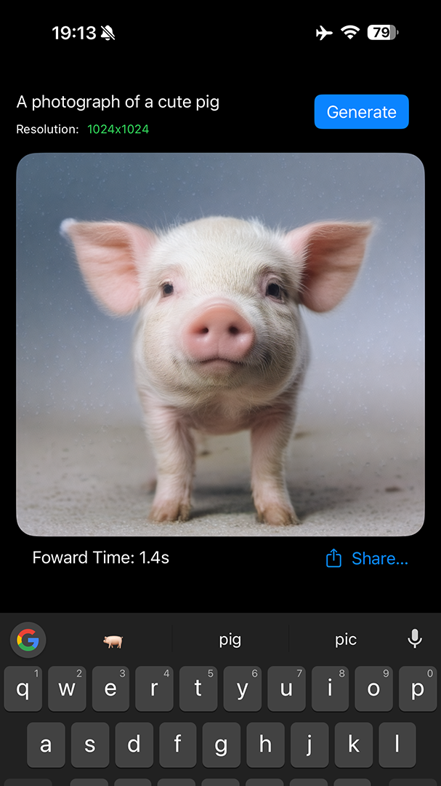
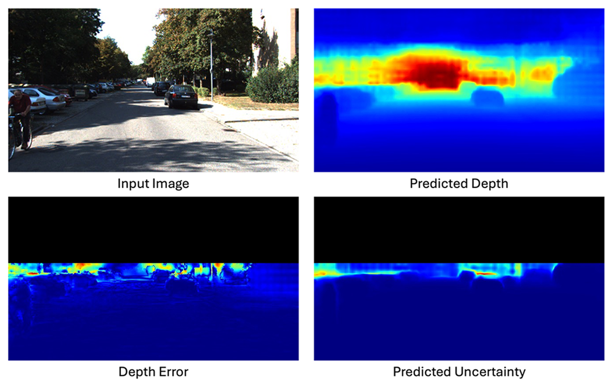

### 2025

  
  

    <strong>SnapGen: Taming High-Resolution Text-to-Image Models for Mobile Devices with Efficient Architectures and Training</strong>   
    Authors: <strong>D. Hu</strong>*, J. Chen*, X. Huang*, H. Coskun, A. Sahni, A. Gupta, A. Goyal, D. Lahiri, R. Singh, Y. Idelbayev, J. Cao, Y. Li, K.-T. Cheng, S.-H. Chan, M. Gong, S. Tulyakov, A. Kag, Y. Xu, J. Ren   
    <em>CVPR, 2025</em>   
    <a href="https://arxiv.org/pdf/2412.09619" target="_blank" style="text-decoration: none;">
      <button style="padding: 5px 10px; font-size: 14px; cursor: pointer; background-color:rgb(90, 170, 250); color: white; border: none; border-radius: 5px;">
        Paper
      </button>
    </a>
    <a href="https://snap-research.github.io/snapgen/" target="_blank" style="text-decoration: none;">
      <button style="padding: 5px 10px; font-size: 14px; cursor: pointer; background-color:rgb(90, 170, 250); color: white; border: none; border-radius: 5px;">
        Project Page
      </button>
    </a>
    <a href="https://newsroom.snap.com/ai-text-to-image-model-for-mobile-devices" target="_blank" style="text-decoration: none;">
      <button style="padding: 5px 10px; font-size: 14px; cursor: pointer; background-color:rgb(90, 170, 250); color: white; border: none; border-radius: 5px;">
        Snap Newsroom
      </button>
    </a>
    <a href="https://techcrunch.com/2025/02/04/snap-unveils-ai-text-to-image-model-for-mobile-devices" target="_blank" style="text-decoration: none;">
      <button style="padding: 5px 10px; font-size: 14px; cursor: pointer; background-color:rgb(90, 170, 250); color: white; border: none; border-radius: 5px;">
        TechCrunch
      </button>
    </a>
  

### 2024

  
  

    <strong>In-N-Out: Lifting 2D Diffusion Prior for 3D Object Removal via Tuning-Free Latents Alignment</strong>   
    Authors: <strong>D. Hu</strong>, H. Fu, J. Guo, L. Peng, T. Chu, F. Liu, T. Liu, M. Gong   
    <em>NeurIPS, 2024</em>   
    <a href="https://openreview.net/pdf?id=gffaYDu9mM" target="_blank" style="text-decoration: none;">
      <button style="padding: 5px 10px; font-size: 14px; cursor: pointer; background-color:rgb(90, 170, 250); color: white; border: none; border-radius: 5px;">
        Paper
      </button>
    </a>
    <a href="https://timmy11hu.github.io/3dor.github.io/" target="_blank" style="text-decoration: none;">
      <button style="padding: 5px 10px; font-size: 14px; cursor: pointer; background-color:rgb(90, 170, 250); color: white; border: none; border-radius: 5px;">
        Project Page
      </button>
    </a>
  

### 2023

  
  

    <strong>Multiscale Representation for Real-Time Anti-Aliasing Neural Rendering</strong>   
    Authors: <strong>D. Hu</strong>, Z. Zhang, T. Hou, T. Liu, H. Fu, M. Gong   
    <em>ICCV, 2023</em>   
    <a href="https://openaccess.thecvf.com/content/ICCV2023/papers/Hu_Multiscale_Representation_for_Real-Time_Anti-Aliasing_Neural_Rendering_ICCV_2023_paper.pdf" target="_blank" style="text-decoration: none;">
      <button style="padding: 5px 10px; font-size: 14px; cursor: pointer; background-color:rgb(90, 170, 250); color: white; border: none; border-radius: 5px;">
        Paper
      </button>
    </a>
    <a href="https://github.com/timmy11hu/Mip-VoG" target="_blank" style="text-decoration: none;">
      <button style="padding: 5px 10px; font-size: 14px; cursor: pointer; background-color:rgb(90, 170, 250); color: white; border: none; border-radius: 5px;">
        Code
      </button>
    </a>
  

### 2022

  
  

    <strong>Uncertainty Quantification in Depth Estimation via Constrained Ordinal Regression</strong>   
    Authors: <strong>D. Hu</strong>, L. Peng, T. Chu, X. Zhang, Y. Mao, H. Bondell, M. Gong   
    <em>ECCV, 2022</em>   
    <a href="https://www.ecva.net/papers/eccv_2022/papers_ECCV/papers/136620229.pdf" target="_blank" style="text-decoration: none;">
      <button style="padding: 5px 10px; font-size: 14px; cursor: pointer; background-color:rgb(90, 170, 250); color: white; border: none; border-radius: 5px;">
        Paper
      </button>
    </a>
    <a href="https://github.com/timmy11hu/ConOR" target="_blank" style="text-decoration: none;">
      <button style="padding: 5px 10px; font-size: 14px; cursor: pointer; background-color:rgb(90, 170, 250); color: white; border: none; border-radius: 5px;">
        Code
      </button>
    </a>
  

